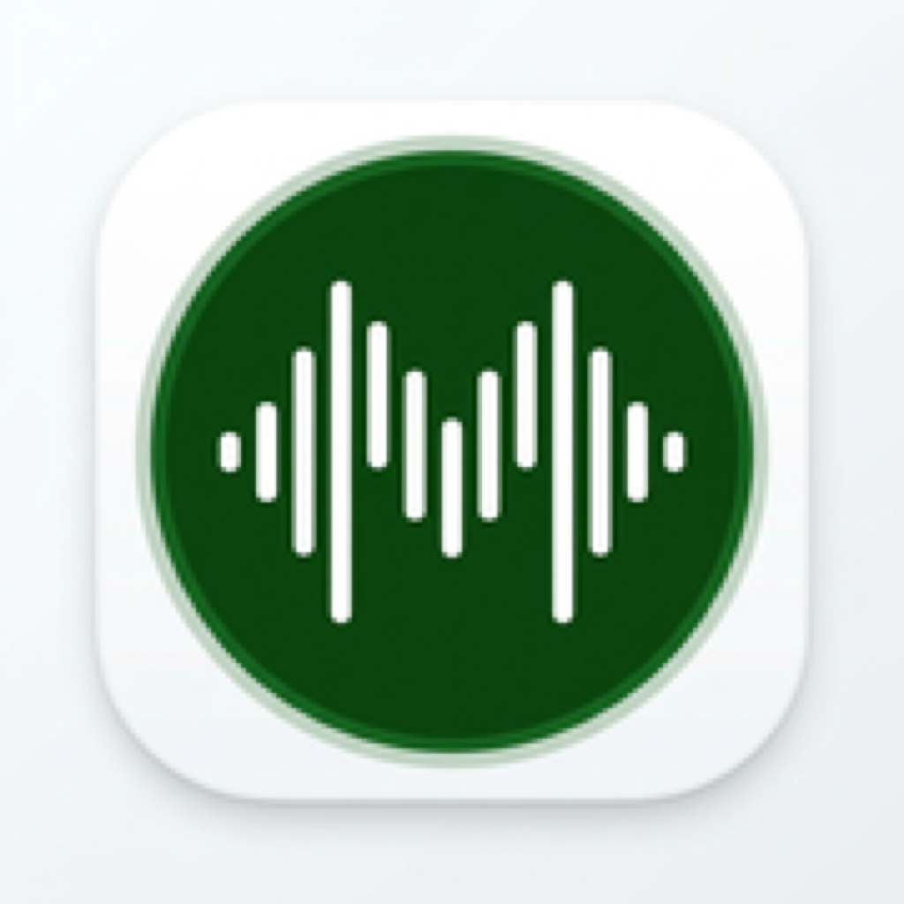
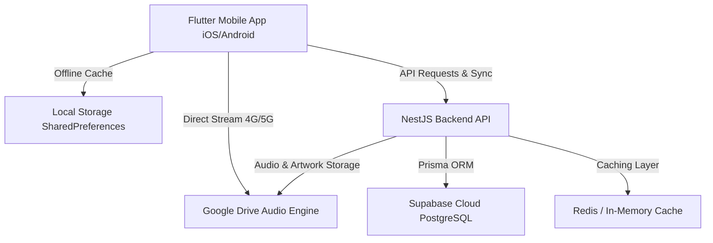

# 🎵 Muxiz — Native Music Streaming Application

<p align="center">
  
</p>

<p align="center">
  <b>A modern, high-performance native music streaming ecosystem for iOS and Android.</b><br>
  Inspired by Spotify and Apple Music, built with Flutter, NestJS, Supabase PostgreSQL, and Google Drive Cloud Storage.
</p>

<p align="center">
  
  
  
  
  
  
</p>

---

## 📥 Direct Downloads (Latest Releases)

Download the production release binaries directly to your device with zero cost and no app store accounts required:

| Platform | File Name | Version | Size | Download Link |
| :--- | :--- | :--- | :--- | :--- |
| 🤖 **Android** | `Muxiz-v1.0.0.apk` | `v1.0.0` | **56 MB** | [Download Android APK](http://192.168.1.94:8080/Muxiz-v1.0.0.apk) |
| 🍎 **iOS** | `Muxiz-v1.0.0.ipa` | `v1.0.0` | **9.7 MB** | [Download iOS IPA](http://192.168.1.94:8080/Muxiz-v1.0.0.ipa) |
| 🌐 **Portal** | Web Download Center | `v1.0.0` | — | [Open Web Portal](http://192.168.1.94:8080) |

> 💡 *Note: The iOS IPA can be sideloaded for free via AltStore, Sideloadly, or TrollStore.*

---

## ✨ Key Features

### 🎧 Seamless Audio Engine
* **24/7 Cloud Streaming**: Direct high-speed streaming from Google Drive and Cloudinary CDN over 4G/5G mobile internet.
* **Background & Lock-Screen Audio**: Full native audio session integration with `AVAudioSession` (iOS) and `AudioManager` (Android) for lock-screen media controls and continuous background playback.
* **Instant 0-Second Preload**: 100+ songs, artist portraits, and album artwork load instantly on app open with zero latency.
* **Queue & Playlist Management**: Seamless next/previous track transitions, repeat modes (Off, All, One), shuffle, and reorderable queue.

### 🎨 Design & Experience
* **Ultra-HD Apple Music Artwork**: Dynamic 1400x1400 official cover art and high-resolution artist master portraits.
* **Fluid Ambient Player**: Glassmorphism UI, adaptive animated background gradients tailored to the current playing track's artwork palette.
* **Instant Smart Search**: Sub-50ms debounced search filtering by songs, artists, movies, and genres.
* **Offline Music Downloads**: Cache and save favorite tracks directly to on-device local storage for airplane mode listening.

### ☁️ Cloud & Backend Architecture
* **Supabase Cloud PostgreSQL**: Production database storing songs, artists, albums, playlists, and user favorites with automated Prisma ORM schemas.
* **Google Drive Storage**: All song uploads and audio streams stored cleanly inside Google Drive folders (`Songs`, `Covers`, `Metadata`).
* **NestJS & Redis**: High-performance RESTful API with automated fallback to ultra-fast in-memory caching.

---

## 🛠️ Developer & Automation Commands

This project includes automated developer workflows via `Makefile` and `scripts/automate.sh`:

```bash
# Run all mobile unit and audio pipeline tests
make test

# Run static analysis and lint checks
make analyze

# Build production Android Release APK
make build-apk

# Build production iOS Release IPA & Xcode Archive
make build-ipa

# Start local backend development server
make dev-backend

# Launch mobile application on connected device/simulator
make dev-mobile
```

---

## 📱 Architecture Overview



---

## 📄 License
Private & Proprietary — Developed for Muxiz Native Music Ecosystem.
