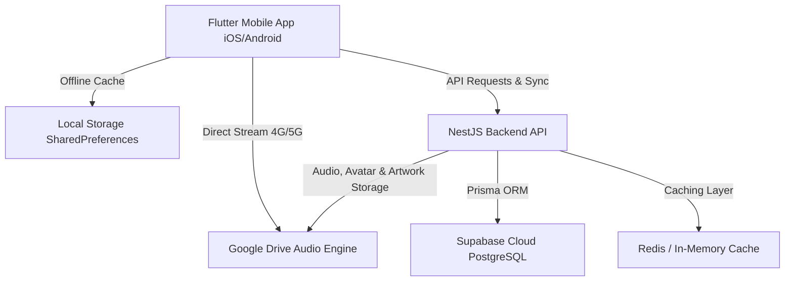

# 🎵 Muxiz — Native Music Streaming Application

<p align="center">
  
</p>

<p align="center">
  <b>A modern, high-performance native music streaming ecosystem for iOS and Android.</b><br>
  Inspired by Spotify and Apple Music, built with Flutter, NestJS, Supabase Cloud PostgreSQL, and Google Drive Cloud Storage.
</p>

<p align="center">
  
  
  
  
  
  
  
</p>

---

## 🌐 Live Cloud Infrastructure & Links

* 🚀 **Render Cloud Backend (24/7 Live)**: [https://flutter-muxiz.onrender.com](https://flutter-muxiz.onrender.com)
* 🐙 **GitHub Repository**: [https://github.com/VelmaniM/Flutter-Muxiz](https://github.com/VelmaniM/Flutter-Muxiz)
* 📥 **Local Web Download Portal**: [http://192.168.1.94:8080](http://192.168.1.94:8080)

---

## 📥 Direct Downloads (Latest Releases)

Download the production release binaries directly to your device with zero cost:

| Platform | File Name | Version | Size | Download Link |
| :--- | :--- | :--- | :--- | :--- |
| 🤖 **Android** | `Muxiz-v1.0.0.apk` | `v1.0.0` | **58 MB** | [Download Android APK](http://192.168.1.94:8080/Muxiz-v1.0.0.apk) |
| 🍎 **iOS** | `Muxiz-v1.0.0.ipa` | `v1.0.0` | **9.7 MB** | [Download iOS IPA](http://192.168.1.94:8080/Muxiz-v1.0.0.ipa) |
| 🌐 **Portal** | Web Download Center | `v1.0.0` | — | [Open Web Portal](http://192.168.1.94:8080) |

> 💡 *Note: The iOS IPA can be sideloaded for free via AltStore, Sideloadly, or TrollStore.*

---

## ✨ Key Features & Capabilities

### 📸 Dynamic User Profile & Cloud Storage
* **Google Drive Avatar Storage**: Pick any custom photo from device gallery; automatically uploads to Google Drive `Covers` folder and links to the user record in Supabase PostgreSQL.
* **Inline Name Editing**: Edit display name directly in-app with instant cloud database and local storage synchronization.
* **Global Avatar Integration**: User photo dynamically updates across the top navigation bar and profile screen.
* **Permanent Persistence**: User avatar and name preferences remain permanently fixed across restarts and sessions.

### 🎧 Seamless Audio Engine & Playback
* **24/7 Cloud Streaming**: Direct high-speed streaming from Google Drive and Cloudflare CDN over 4G/5G mobile internet.
* **Background & Lock-Screen Audio**: Full native audio session integration with `AVAudioSession` (iOS) and `AudioManager` (Android) with lock-screen media controls.
* **Interactive Sorting & Deterministic Order**: Sort music by *Recently Added*, *Title (A-Z)*, *Title (Z-A)*, *Artist (A-Z)*, or *Duration* with persistent state saved to device disk.
* **Accurate Music Counter**: Displays exact database track count dynamically without random fluctuation or reordering on pull-to-refresh.

### ⚡ Sequential High-Speed Upload Pipeline
* **One-by-One Sequential Uploads**: Reliable batch uploading that processes songs strictly one by one with real-time per-song progress tracking.
* **Apple Music India Ultra-HD Metadata**: Automated matching for 1400x1400 artwork, verified artist names, album titles, and clean movie tags.
* **Google Drive Multi-Folder Ingestion**: Automatic parallel buffer ingestion into `Songs`, `Covers`, and `Metadata` folders.

### 🎨 Premium Design System
* **Fluid Ambient Player**: Glassmorphism UI, adaptive animated background gradients tailored to the current playing track's artwork palette.
* **Instant Smart Search**: Sub-50ms debounced search filtering by songs, artists, movies, and genres.
* **Offline Music Downloads**: Cache and save favorite tracks directly to on-device local storage for airplane mode listening.

---

## 🛠️ Developer & Automation Commands

```bash
# Run all mobile unit and audio pipeline tests
make test

# Run static analysis and lint checks
make analyze

# Build production Android Release APK
make build-apk

# Build production iOS Release IPA & Xcode Archive
make build-ipa

# Start local backend development server
make dev-backend

# Launch mobile application on connected device/simulator
make dev-mobile
```

---

## 📱 Architecture Overview



---

## 📄 License
Private & Proprietary — Developed for Muxiz Native Music Ecosystem.
